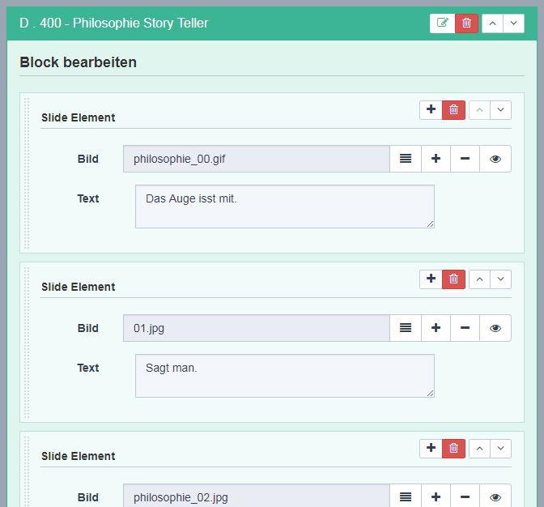

## MBlock - AddOn zur Gruppierung von Elementen

Aufklapper (Akkordeons), Teamseiten oder Galerien sind immer gleich aufgebaut: Ein Containerelement mit einer Überschrift, dann die einzelnen Inhaltselemente mit den stets gleich aufgebauten Inhalten. Hier ist MBlock zuhause und löst die Aufgabe für Programmierer und Redakteur mit Bravour.

MBlock ermöglicht die Gruppierung von Inhaltselementen. Das ist sehr praktisch z.B. für Galerien, oder Teamseiten, in denen die einzelnen Elemente nicht nur aus einem Bild aus dem Medienpool bestehen sollen sondern noch weitere Merkmale wie Bildbeschreibung, Links und ähnliches enthalten sollen. Ohne das MBlock AddOn ist das recht aufwändig zu realisieren. Man muss dann die Elemente als einzelne Blöcke einsetzen. Dann muss ein extra Anfangs- und Endelement gesetzt werden oder es muss im Modul ermittelt werden, ob es ein gleichartiges vorhergehendes oder nachfolgendes Element gibt.

MBlock kommt mit einer praktischen Dokumentation innerhalb des AddOns, so dass man immer nachschauen kann wie etwas gebaut wird. Es fügt sich sehr geschmeidig in die REDAXO Architektur ein. Nicht wundern darf man sich über die Nähe zu MForm. Die AddOns stammen aus der gleichen Feder. Man kann MBlock mit MForm verwenden oder auch nicht.

Man kann in MBlock optional eine Mindestanzahl und/oder eine Maximalanzahl an Elementen definieren welche ein Container haben muss bzw. maximal enthalten darf.

In MBlock ist ein Slice (Block) der Container für ein oder mehrere Elemente. Es können einzelne Elemente hinzugefügt oder gelöscht werden und die Elemente lassen sich per Drag&Drop in der Reihenfolge ändern. Die einzelnen Elemente können beliebige Input Elemente enthalten. Neben den Standard Formularelmenten Input, Textarea, Radio, Select und Checkbox sind Links, Linklisten, Media und Medialisten verwendbar. MBlock speichert die Inhalte im JSON Format in den Value Feldern des Slices.

Normalerweise bestehen die einzelnen Elemente innerhalb eines MBlock Inhaltselementes aus gleichartigen Blöcken mit gleichen Inhaltsfeldern. Mit etwas Programmierkenntnis ist es aber möglich verschiedenartige Elemente zu einzusetzen.

```php
$id = 1;

 $form = "
<fieldset class=\"form-horizontal\">
    <legend>Slide Element</legend>        
    <div class=\"form-group\">
        <label class=\"col-sm-2 control-label\">Bild</label>
        <div class=\"col-sm-10\">
          REX_MEDIA[id=1 widget=1]
        </div>
    </div>
    <div class=\"form-group\">
        <label class=\"col-sm-2 control-label\">Text</label>
        <div class=\"col-sm-10\">
            <textarea name=\"REX_INPUT_VALUE[{$id}][0][text]\" class=\"form-control\"></textarea>
        </div>
    </div>   
</fieldset>";
        
// parse form
echo MBlock::show($id, $form);
```

### MBlock Backend Beispiel



_So sieht das Beispiel im Backend aus. Man kann Elemente an beliebiger Stelle einfügen, Elemente löschen oder die Elemente per Pfeilnavigation oder Drag&Drop umsortieren._

Eine Erweiterung, die seit Mitte 2018 in MBlock vorhanden ist, erlaubt auch MBlock Elemente in rex_form Formularen. Hierfür ist im AddOn eine Demo enthalten.

Initiator: Thomas Skerbis (klxm)

Umsetzung: Joachim Dörr

Lizenz: MIT (Friends of REDAXO)

Referenz:

(https://www.furore.ch/philosophie)

...

[zur AddOn Übersicht](/)